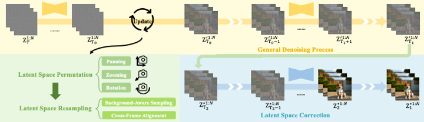

# LightMotion: A Light and Tuning-free Method for Simulating Camera Motion in Video Generation

## Abstract

Existing camera motion-controlled video generation methods face computational bottlenecks in fine-tuning and inference. This paper proposes \method, a light and tuning-free method for simulating camera motion in video generation. Operating in the latent space, it eliminates additional fine-tuning, inpainting, and depth estimation, making it more streamlined than existing methods. The endeavors of this paper comprise: (i) The latent space permutation operation effectively simulates various camera motions like panning, zooming, and rotation. (ii) The latent space resampling strategy combines background-aware sampling and cross-frame alignment to accurately fill new perspectives while maintaining coherence across frames. (iii) Our in-depth analysis shows that the permutation and resampling cause an SNR shift in latent space, leading to poor-quality generation. To address this, we propose latent space correction, which reintroduces noise during denoising to mitigate SNR shift and enhance video generation quality. Exhaustive experiments show that our \method outperforms existing methods, both quantitatively and qualitatively.